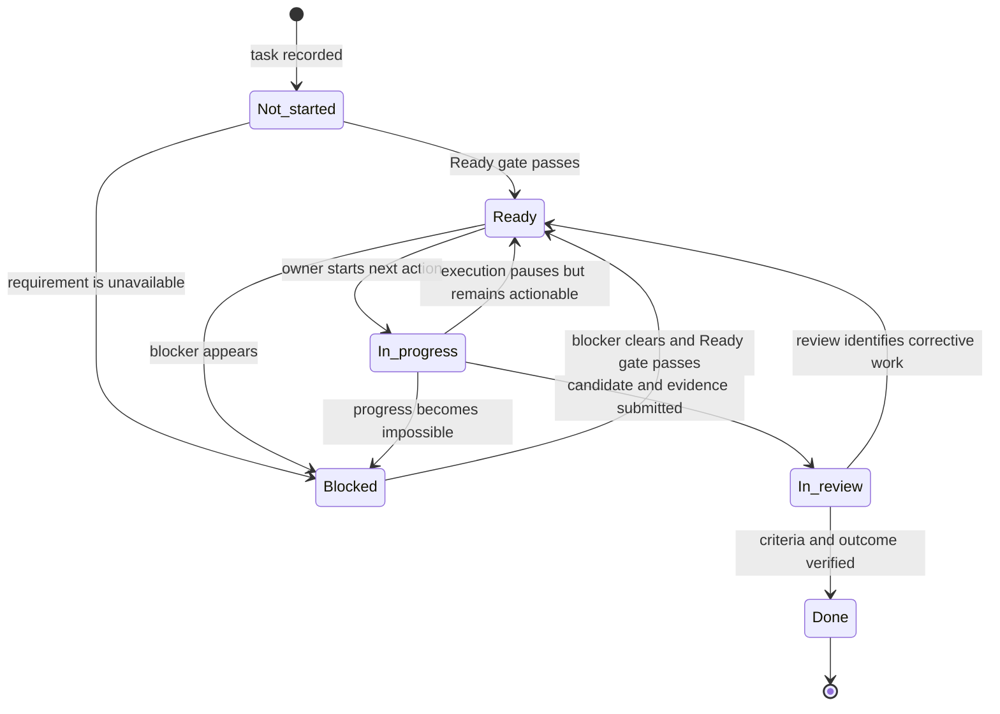

# Task-management processes for AI agents

This document defines task-management processes for work performed by AI agents. It uses a six-process lifecycle that makes tool access, persistent state, evidence, handoffs, and human escalation explicit.

## Operating rules

1. **Status records the task's current condition.** Intent, priority, dates, and agent activity do not determine status.
2. **Every task has one accountable owner agent before it becomes Ready.** Other agents may plan, research, execute subtasks, or review, but one agent remains responsible for moving the task forward.
3. **Ready is a strict execution gate.** A task is Ready only when:
   - the task, outcome, and definition of done are clear;
   - one owner agent has accepted accountability;
   - every required input is accessible now;
   - every dependency is cleared;
   - the required tools, permissions, and execution environment are available;
   - the next action can be performed now; and
   - the task record contains enough context to perform that action correctly without relying on hidden conversation state.
4. **Blocked means the agent cannot continue.** The task must name the unavailable condition and the event or time that will cause it to be checked again.
5. **Agents persist state instead of relying on memory.** After each meaningful step, the task record points to the latest artifacts, evidence, decisions, active job handles, and next action.
6. **Every task is reviewed before it becomes Done.** The reviewer checks both the definition of done and the intended outcome. Use a separate reviewer or human approver when independent judgment is required.
7. **Field values change when the facts change.** A status change and its supporting field updates are one operation.

## Exact meaning of operational terms

- **Available input:** The owner agent can read and use the input in its current execution environment.
- **Usable tool:** The agent can invoke the required tool now with the needed permissions and environment.
- **Sufficient context:** The task record contains the source locations, constraints, decisions, and instructions needed to act correctly. Important facts are stored outside transient model memory.
- **Cleared dependency:** The required result, event, decision, approval, or external job has completed successfully.
- **Next action:** One specific tool operation or other observable action that can start without more planning. It begins with a verb and names its target.
- **Blocker:** A named unmet condition that prevents the next action or prevents active work from continuing.
- **Checkpoint:** Persisted state that lets the same or another agent resume without reconstructing prior work.
- **Evidence:** Inspectable output that proves a completion criterion passed, such as a file, diff, command result, test report, screenshot, or approval record.
- **Outcome satisfied:** The completed result creates the effect stated in **Outcome**, rather than merely creating an artifact or reporting success.
- **Review or follow-up:** An exact time or observable event that causes the task to be resumed and checked.
- **True deadline:** The time by which the result is genuinely required. It is recorded in **Due**.
- **Scheduled time:** The time or execution window reserved for the work. It is recorded in **Scheduled**.

## Status definitions and transitions

| Status | Exact meaning | Required condition for leaving it |
| --- | --- | --- |
| **Not started** | The task is recorded but has not passed the Ready gate. Execution has never begun. | Complete definition and preparation, then move to **Ready** or **Blocked**. |
| **Ready** | The task passes every Ready-gate rule and its next action can run now. | The owner agent starts it, or a new blocker appears. |
| **In progress** | The owner agent has started execution, work remains, and no blocker prevents progress. | Submit a candidate result, record a blocker, or return actionable paused work to **Ready**. |
| **Blocked** | A named unavailable condition prevents progress. **Dependencies** names it and **Review or follow-up** states when it will be checked. | Clear the blocker, run the complete Ready gate again, and move to **Ready**. |
| **In review** | Execution produced a candidate result and evidence. A reviewer is checking the definition of done and outcome. | Accept it as **Done** or return it to **Ready** with a concrete corrective action. |
| **Done** | Every definition-of-done condition passes and the outcome is satisfied. | None. **Done** is terminal. |

No transition skips the Ready gate or review. A small task may pass through **In progress** and **In review** immediately, but both checks still occur.

## Process 1: Interpret the work

**Purpose:** Convert a request, event, or goal into one clear and verifiable agent task.

**Starts when:** New work is received or the intended result changes.

**Responsible role:** The orchestrator or task-creation agent. After assignment, the owner agent participates in any reinterpretation.

**Uses:** **Task**, **Outcome**, **Definition of done**, and **Context**.

### Procedure

1. Read the source request and linked source material.
2. Write **Task** as an action verb, a specific object, and any qualifier needed to distinguish the work.
3. Confirm that the task represents one coherent result. If it contains independently completable results, create one task for each result and let an orchestrator track the combined outcome.
4. Write **Outcome** as the practical effect the completed work must create for the requester or system.
5. Write **Definition of done** as a finite checklist of observable pass-or-fail conditions. Name the required artifacts, behavior, evidence, delivery, and approval.
6. Add to **Context** the governing instructions, constraints, prior decisions, source locations, and relevant environment details. Preserve authoritative text by reference rather than paraphrasing it repeatedly.
7. Resolve contradictions according to the instruction hierarchy. Ask for clarification only when missing information prevents a correct interpretation.
8. Set **Status** to **Not started** while preparation remains incomplete.

### Completion test

Interpretation is complete when an agent with no access to the original conversation can answer:

1. What result must be produced?
2. Why must it be produced?
3. What observable evidence will prove completion?
4. Which instructions and source materials govern the work?

**Output:** A coherent task in **Not started**, ready for preparation. A changed task returns through this process before preparation or review continues.

## Process 2: Prepare the agent and environment

**Purpose:** Make the interpreted task immediately executable by one accountable agent.

**Starts when:** Process 1 is complete or a blocker has cleared.

**Responsible role:** The owner agent. The orchestrator assigns the initial owner; the owner accepts the task.

**Uses:** **Owner**, **Inputs**, **Dependencies**, **Next action**, **Context**, and **Status**.

### Procedure

1. Assign exactly one **Owner** agent whose capabilities match the work.
2. List every required **Input**, including files, data, repositories, services, credentials, tools, people, and approvals.
3. Verify availability by reading each input or performing the smallest useful access check.
4. List each **Dependency** as a condition that must be true before execution can proceed. Include unfinished subagent work and external jobs by result, not only by agent name or job handle.
5. Verify whether every dependency is cleared.
6. Confirm that the required tools, permissions, runtime, working directory, and persistent output location are available.
7. Write **Next action** as the first concrete operation the agent can perform. Name the tool or action and its target when that detail matters.
8. Ensure **Context** contains enough information to perform that action without reconstructing hidden history.
9. Apply the Ready gate:
   - If every condition passes, set **Status** to **Ready**.
   - If a requirement is unavailable, set **Status** to **Blocked**, name the condition in **Dependencies**, and set **Review or follow-up**.

### Completion test

Preparation is complete when the task is in exactly one of these states:

- **Ready:** The owner agent can perform the recorded next action now.
- **Blocked:** The owner agent cannot proceed, the blocking condition is explicit, and its next check is explicit.

**Output:** An owned task in **Ready** or **Blocked**.

## Process 3: Plan and route the work

**Purpose:** Decide when the task should receive compute, tool access, and agent capacity relative to other work.

**Starts when:** The prepared task enters planning, whether it is **Ready** or **Blocked**.

**Responsible role:** The orchestrator, scheduler, or triage agent. The owner agent supplies effort and capability information.

**Uses:** **Due**, **Priority**, **Effort**, and **Scheduled**.

### Procedure

1. Record **Due** only when a real requirement, commitment, or external event establishes a deadline.
2. Set **Priority** according to value and consequence relative to competing tasks. Record the reason.
3. Estimate **Effort** in the unit used for capacity planning, such as agent turns, tool calls, elapsed job time, compute, or task size.
4. Compare due date, priority, effort, required capabilities, and available capacity with existing work.
5. Reserve enough **Scheduled** capacity to complete the task before **Due**, when a deadline exists.
6. Identify independent, context-heavy subtasks when parallel work will improve the outcome. Record the delegation plan while keeping one owner accountable for combining the results.
7. For slow or asynchronous work, record how the job will be started, where its handle and output will be stored, and which event will cause its result to be checked.
8. Keep status unchanged. Planning and routing allocate capacity; they do not make a blocked task Ready or start a Ready task.

### Completion test

Planning is complete when:

- the task's relative importance is explicit;
- its capability and capacity needs are understood well enough to route it; and
- its scheduled time is realistic, or **Scheduled** is intentionally blank because capacity has not yet been reserved.

**Output:** A prioritized, routed, and optionally scheduled task. **Due** means required completion; **Scheduled** means intended execution time.

## Process 4: Execute and control the work

**Purpose:** Produce the result through observable actions while keeping durable task state accurate.

**Starts when:** The owner agent selects a **Ready** task and begins its next action.

**Responsible role:** The owner agent.

**Uses:** **Next action**, **Context**, **Inputs**, **Dependencies**, **Status**, and **Review or follow-up**.

### Procedure

1. Reconfirm the Ready gate immediately before execution.
2. Set **Status** to **In progress** when the first action begins.
3. Inspect the current source of truth before changing it.
4. Perform the smallest complete action that advances the task. Use the target system's normal interface and environment.
5. Inspect the actual result of the action. Do not treat a tool call, generated text, or a subagent's claim as proof by itself.
6. After each meaningful step, persist changed artifacts, evidence, decisions, active job handles, and the next concrete action.
7. Keep **Context**, **Inputs**, and **Dependencies** current when execution reveals new facts.
8. Choose the resulting state:
   - Keep **In progress** while active execution can continue.
   - Move to **Ready** when execution pauses but remains immediately actionable. Record a resumable checkpoint and update **Next action** and **Scheduled**.
   - Move to **Blocked** when an unmet condition makes progress impossible. Name it in **Dependencies**, persist the checkpoint, and set **Review or follow-up**.
   - Move to **In review** when the owner believes every definition-of-done criterion passes and provides the candidate result and evidence.
9. When a blocker clears, run Process 2 again. A blocked task returns to **Ready** before execution resumes.

### Completion test

Execution is controlled when **Status** matches reality, all useful work is persisted, and every unfinished actionable task has one current next action.

**Output:** Work remains in **In progress**, pauses in **Ready** or **Blocked**, or advances to **In review** with a candidate result and evidence.

## Process 5: Review and close the work

**Purpose:** Verify the result and its intended effect before closing the task.

**Starts when:** The owner agent submits a candidate result and sets **Status** to **In review**.

**Responsible role:** A reviewer agent or human approver. Use a clean-context reviewer when independent judgment matters. Any human approval named in the definition of done must come from that person.

**Uses:** **Definition of done**, **Outcome**, **Context**, **Next action**, and **Status**.

### Procedure

1. Inspect the candidate in its actual destination and read the supplied evidence.
2. Check every definition-of-done criterion separately and mark it pass or fail from observable evidence.
3. Check **Outcome** separately. Confirm that the result creates the stated effect and does not merely produce the requested artifact.
4. Review from first principles. Look for incorrect assumptions, redundant work, unnecessary structure, and missing behavior. Preserve unaffected behavior unless the task authorizes a broader change.
5. Run the smallest meaningful independent check when a claim remains uncertain.
6. Record the decision:
   - If every criterion passes and the outcome is satisfied, set **Status** to **Done** and record the evidence and approval in **Context**.
   - If any criterion fails or the outcome is not satisfied, record the missing result, write one concrete corrective action, and set **Status** to **Ready**.
7. Apply approved scope changes through Process 1. Update **Outcome** and **Definition of done** before reviewing against the changed commitment.

### Completion test

Closure is complete only when inspectable evidence supports every completion criterion and the intended outcome.

**Output:** An accepted task in **Done**, or a rejected result in **Ready** with explicit corrective work.

## Process 6: Monitor and orchestrate the work

**Purpose:** Keep waiting work, asynchronous jobs, deadlines, schedules, dependencies, reviews, and handoffs reliable over time.

**Starts when:** A tracked date or event occurs, an external job reports a change, or a scheduled coordination pass begins.

**Responsible role:** The scheduler, monitoring service, or orchestrator agent. The owner, planner, reviewer, and human requester act on its notices.

**Uses:** **Status**, **Due**, **Scheduled**, **Dependencies**, **Review or follow-up**, **Owner**, and **Tags**.

### Procedure

For every task that is not **Done**:

1. **Check blockers.** When a dependency changes, run the complete Ready gate and move the task from **Blocked** to **Ready** only when every condition passes.
2. **Check follow-ups.** When the **Review or follow-up** time or event occurs, inspect the task once. If the blocker remains, notify the owner and set the next check. If it cleared, prepare the task again.
3. **Check asynchronous work.** Read the stored job or subagent result when a completion event arrives. Persist useful output, update dependencies, and set the next action. Do not busy-poll.
4. **Check scheduled work.** When an execution window begins, surface the task to the owner agent. If the window passes, schedule a new one; change **Due** only when the true deadline changes.
5. **Check deadlines.** Compare remaining effort and scheduled capacity with **Due**. Escalate deadline risk to the owner and planner. If the deadline passes before **Done**, flag the task as overdue while preserving the status that describes its actual work condition.
6. **Check review.** Route each **In review** task and its evidence to the reviewer until it is accepted or returned for correction.
7. **Check resumability.** Confirm that paused tasks contain a durable checkpoint, artifact locations, current dependencies, and one next action.
8. **Maintain organization.** Apply **Tags** for project, area, capability, environment, requester, or work type so routing and retrieval views remain accurate.

### Completion test

Monitoring is current when every reached time or event has been processed, every blocked task has a future resume trigger, every active external job has a stored handle, every deadline risk has an owner response, and each paused task can be resumed from persisted state.

**Output:** Current statuses, resume triggers, routed results, deadline warnings, review requests, and resumable task records.

## Role accountability

One agent or service may perform several roles, but each responsibility remains explicit.

| Role | Accountable for |
| --- | --- |
| **Requester** | Stating the desired result and supplying required information. |
| **Orchestrator or task-creation agent** | Interpreting the request, creating tasks, assigning one owner, coordinating delegation, and combining results. |
| **Owner agent** | Accepting the task, preparing and executing it, maintaining durable state, reporting blockers, and submitting evidence for review. |
| **Planner or scheduler** | Setting relative priority, checking capacity and capabilities, reserving execution time, and scheduling resume events. |
| **Reviewer agent** | Independently checking every completion criterion and the outcome, then accepting or returning the result. |
| **Monitoring service or coordinator** | Processing scheduled events and job results, surfacing tasks, and notifying responsible roles. |
| **Human approver** | Making decisions that require authority, preference, policy judgment, or approval reserved for a person. |

The owner agent remains accountable for progress while other agents perform subtasks, planning, review, or monitoring.

## Meaning of blank fields

A blank field has a precise meaning after the task passes the Ready gate:

| Blank field | Meaning |
| --- | --- |
| **Context** | The other fields and referenced sources contain all information needed to act correctly. |
| **Inputs** | No external material, access, service, person, or approval is required. |
| **Dependencies** | No preceding condition or unfinished external job prevents progress. |
| **Due** | No true deadline exists. |
| **Scheduled** | No execution window is currently reserved. |
| **Effort** | Capacity has not been estimated because the task has not required capacity planning. |
| **Review or follow-up** | No waiting condition requires a resume event. This field must have a value while **Blocked**. |
| **Tags** | The task requires no grouping beyond its default project or location. |

For a **Not started** task, a blank field may still be unassessed. The Ready gate distinguishes “not yet checked” from “checked and not applicable.”
