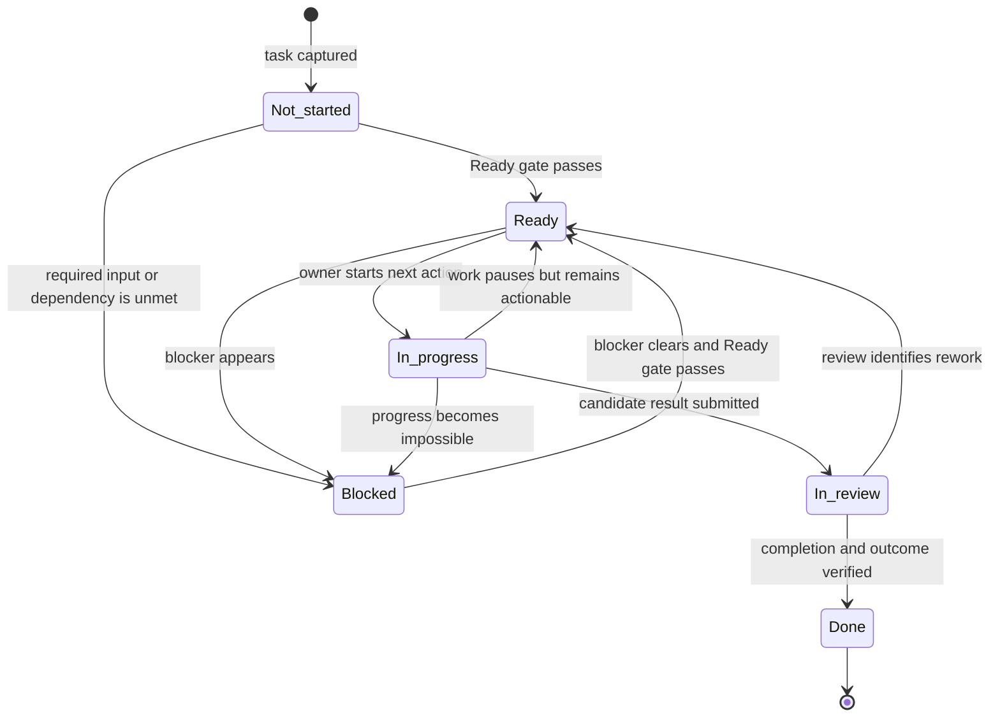

# Implied task-management processes

The fields in [How task fields are used](./field-usage.md) define one task lifecycle made of six processes. This document makes each process explicit: who acts, when it starts, what they do, and what state they produce.

## Operating rules

1. **Status records the task's current condition.** Dates, priority, and intent do not determine status.
2. **Every task has one accountable owner before it becomes Ready.** Other people may contribute, approve, plan, or review it.
3. **Ready is a strict gate.** A task is Ready only when:
   - the task, outcome, and definition of done are clear;
   - one owner has accepted accountability;
   - every required input is available now;
   - every dependency is cleared;
   - the owner can perform the next action now; and
   - the context contains everything needed to perform that action correctly.
4. **Blocked means progress cannot continue.** The task must name the unmet condition and when or how it will be checked again.
5. **Every task is reviewed before it becomes Done.** Review may be brief or performed by the owner when independent approval is unnecessary.
6. **Field values are updated when the facts change.** A status change and its supporting field updates are one operation.

## Exact meaning of operational terms

- **Available input:** The person who needs the input can open, access, and use it now.
- **Cleared dependency:** The required preceding result, event, decision, or approval has occurred.
- **Next action:** One specific physical or digital action that can be started without more planning. It starts with a verb and names its object.
- **Blocker:** A named unmet condition that prevents the next action or prevents active work from continuing.
- **Observable completion criterion:** A condition a reviewer can mark pass or fail from visible evidence.
- **Outcome satisfied:** The completed result produces the effect stated in **Outcome**, rather than merely producing an artifact.
- **Review or follow-up:** An exact date and time or an observable event that causes the task to be checked again.
- **True deadline:** The time by which the result is genuinely required. It is recorded in **Due**.
- **Scheduled time:** The time reserved for doing the work. It is recorded in **Scheduled**.

## Status definitions and transitions

| Status | Exact meaning | Required condition for leaving it |
| --- | --- | --- |
| **Not started** | The task has been captured but has not yet passed the Ready gate. Work has never begun. | Complete definition and preparation, then move to **Ready** or **Blocked**. |
| **Ready** | The task passes every Ready-gate rule and can be started now. It may be scheduled or unscheduled. | The owner starts it, or a new blocker appears. |
| **In progress** | The owner has started execution, work remains, and no blocker currently prevents progress. | Submit the result for review, record a blocker, or return actionable paused work to **Ready**. |
| **Blocked** | A named unmet condition prevents progress. **Dependencies** states the condition and **Review or follow-up** states when it will be checked. | Clear the blocker, confirm the complete Ready gate again, and move to **Ready**. |
| **In review** | Execution has produced a candidate result. A reviewer is checking the definition of done and outcome. | Accept it as **Done** or return it to **Ready** with a concrete next action. |
| **Done** | Every definition-of-done condition passes and the outcome is satisfied. | None. **Done** is terminal. |

No transition skips the Ready gate or the review step. A quick task may pass through **In progress** and **In review** immediately, but those checks still occur.

## Process 1: Define the work

**Purpose:** Turn a request, idea, or commitment into one clear and verifiable task.

**Starts when:** New work is captured or an existing task's intended result changes.

**Responsible role:** The task creator. After assignment, the owner participates in any redefinition.

**Uses:** **Task**, **Outcome**, **Definition of done**, and **Context**.

### Procedure

1. Write **Task** as an action verb, a specific object, and any qualifier needed to distinguish the work.
2. Confirm that the task represents one coherent result. If it contains independently completable results, treat it as a project and create one task for each result.
3. Write **Outcome** as the practical effect the completed work must create. State why the result matters to its recipient or objective.
4. Write **Definition of done** as a finite checklist of observable pass-or-fail conditions. Include required delivery, approval, or communication as criteria.
5. Add only the **Context** needed to make correct decisions: relevant background, constraints, prior decisions, instructions, and links.
6. Read the four fields together and resolve contradictions. The title must describe the work, the outcome must explain its purpose, and the definition of done must prove both completion and delivery.
7. Set **Status** to **Not started** while preparation remains incomplete.

### Completion test

Definition is complete when a person unfamiliar with the original conversation can answer all three questions from the task alone:

1. What result must be produced?
2. Why must it be produced?
3. What observable evidence will prove completion?

**Output:** A coherent task in **Not started**, ready for preparation. A changed task returns through this process before it is prepared or reviewed again.

## Process 2: Prepare the work

**Purpose:** Make the defined task immediately executable by one accountable owner.

**Starts when:** Process 1 is complete or a blocker has cleared.

**Responsible role:** The owner. The task creator assigns the initial owner; the owner explicitly accepts accountability.

**Uses:** **Owner**, **Inputs**, **Dependencies**, **Next action**, **Context**, and **Status**.

### Procedure

1. Assign exactly one **Owner** and obtain their acceptance.
2. List every required **Input**, including documents, data, access, people, and approvals.
3. Verify each input by opening it, accessing it, or confirming that the required person or approval is available.
4. List each **Dependency** as a condition that must be true before work can proceed. Record the condition itself, rather than a vague subject or person.
5. Verify whether every dependency is cleared.
6. Write **Next action** as the first concrete action the owner can perform. It must be small enough to start immediately and specific enough to require no further task planning.
7. Confirm that **Context** is sufficient for that action. Add missing instructions, constraints, decisions, or links.
8. Apply the Ready gate:
   - If every condition passes, set **Status** to **Ready**.
   - If a required input or dependency is unmet, set **Status** to **Blocked**, name the unmet condition in **Dependencies**, and set **Review or follow-up**.

### Completion test

Preparation is complete when the task is in exactly one of these states:

- **Ready:** The owner can perform the recorded next action now.
- **Blocked:** The owner cannot proceed, the blocking condition is explicit, and its next check is explicit.

**Output:** An owned task in **Ready** or **Blocked**.

## Process 3: Plan the work

**Purpose:** Decide when the task should receive capacity relative to other work.

**Starts when:** The prepared task enters planning, whether it is **Ready** or **Blocked**.

**Responsible role:** The planner or triage role. The owner supplies effort information and confirms the schedule is realistic.

**Uses:** **Due**, **Priority**, **Effort**, and **Scheduled**.

### Procedure

1. Record **Due** only when a real requirement, commitment, or external event establishes a deadline.
2. Set **Priority** according to the task's value and consequence relative to competing work. Include the reason for the level.
3. Estimate **Effort** in the unit used for capacity planning, such as hours, work sessions, or task size.
4. Compare due date, priority, and effort with existing commitments.
5. Reserve enough **Scheduled** time to complete the work. Place that time before **Due** when a deadline exists.
6. Resolve capacity conflicts by giving earlier capacity to the task with the stronger deadline consequence or priority reason.
7. Keep status unchanged. Planning allocates capacity; it does not make a blocked task Ready or start a Ready task.

### Completion test

Planning is complete when:

- the task's relative importance is explicit;
- its capacity need is understood well enough to place it; and
- its scheduled time is realistic, or **Scheduled** is intentionally blank because capacity has not yet been reserved.

**Output:** A prioritized and, when capacity is reserved, scheduled task. **Due** continues to mean required completion; **Scheduled** continues to mean intended work time.

## Process 4: Execute and control the work

**Purpose:** Produce the result while keeping the task's current state and next step accurate.

**Starts when:** The owner chooses a **Ready** task and begins its next action.

**Responsible role:** The owner.

**Uses:** **Next action**, **Context**, **Inputs**, **Dependencies**, **Status**, and **Review or follow-up**.

### Procedure

1. Reconfirm the Ready gate immediately before starting.
2. Set **Status** to **In progress** when the owner begins the recorded next action.
3. Perform the next action using the attached inputs and context.
4. After each meaningful step, record the next concrete action if work remains.
5. Keep **Context**, **Inputs**, and **Dependencies** current when execution reveals new facts.
6. Choose the resulting state:
   - Keep **In progress** while active work can continue.
   - Move to **Ready** when work pauses for scheduling or priority reasons but remains immediately actionable. Update **Next action** and **Scheduled**.
   - Move to **Blocked** when an unmet condition makes progress impossible. Name it in **Dependencies** and set **Review or follow-up**.
   - Move to **In review** when the owner believes every definition-of-done criterion is satisfied and can provide the result for verification.
7. When a blocker clears, run Process 2 again. A blocked task returns to **Ready** before execution resumes.

### Completion test

Execution is controlled when **Status** describes reality and every unfinished actionable task has one current next action.

**Output:** Work remains accurately in **In progress**, pauses in **Ready** or **Blocked**, or advances to **In review** with a candidate result.

## Process 5: Review and close the work

**Purpose:** Verify completion and the intended result before closing the task.

**Starts when:** The owner submits a candidate result and sets **Status** to **In review**.

**Responsible role:** The reviewer. The owner may review their own task when no separate approver or independent judgment is required. Any approval named in the definition of done must be given by the named approver.

**Uses:** **Definition of done**, **Outcome**, **Context**, **Next action**, and **Status**.

### Procedure

1. Inspect the candidate result and the evidence supplied by the owner.
2. Check every definition-of-done criterion separately and mark each one pass or fail.
3. Check **Outcome** separately. Confirm that the result creates the stated practical effect.
4. Record the decision:
   - If every criterion passes and the outcome is satisfied, set **Status** to **Done** and record the review result or approval in **Context**.
   - If any criterion fails or the outcome is unsatisfied, record what is missing, write the next corrective action, and set **Status** to **Ready**.
5. Apply approved changes to scope through Process 1. Update **Outcome** and **Definition of done** before reviewing against the changed commitment.

### Completion test

Closure is complete only when there is visible evidence for every completion criterion and for the stated outcome.

**Output:** An accepted task in **Done**, or a rejected result in **Ready** with explicit rework.

## Process 6: Monitor and organize the work

**Purpose:** Keep waiting work, deadlines, schedules, dependencies, and retrieval views reliable over time.

**Starts when:** At the start of each workday and whenever a tracked date, dependency, or follow-up condition changes.

**Responsible role:** The monitoring system or coordinator. The owner and planner act on the resulting reminders and decisions.

**Uses:** **Status**, **Due**, **Scheduled**, **Dependencies**, **Review or follow-up**, **Owner**, and **Tags**.

### Procedure

For every task that is not **Done**:

1. **Check blockers.** If a dependency cleared, run the full Ready gate and move the task from **Blocked** to **Ready** only when every condition passes.
2. **Check follow-ups.** When the **Review or follow-up** date or condition occurs, inspect the task. If the blocker remains, notify the owner and set the next exact review point. If it cleared, prepare the task again.
3. **Check scheduled work.** When a scheduled work period begins, surface the task to the owner. If the period passes before work starts, the owner and planner reserve a new period; **Due** changes only when the true deadline changes.
4. **Check deadlines.** Compare remaining effort and scheduled capacity with **Due**. If the plan no longer supports completion by the deadline, notify the owner and planner immediately. If the due time passes before **Done**, flag the task as overdue and escalate it to the owner and planner. Status still reflects the task's work condition.
5. **Check review.** Surface every **In review** task to its reviewer until it is accepted or returned for rework.
6. **Maintain organization.** Apply **Tags** that describe the task's project, area, client, location, skill, or work type. Use those tags and status to populate lists, boards, deadline views, and reports.

### Completion test

Monitoring is current when every reached date and condition has been processed, every blocked task has a future review point, every deadline risk has an owner response, and each task appears in the views implied by its status and tags.

**Output:** Current statuses, renewed follow-up points, surfaced work, deadline warnings, and accurate views.

## Role accountability

One person may perform several roles, but each responsibility remains explicit.

| Role | Accountable for |
| --- | --- |
| **Task creator** | Capturing the source request and completing Process 1 before handoff. |
| **Owner** | Accepting the task, preparing it, executing it, maintaining its operational fields, reporting blockers, and submitting it for review. |
| **Planner or triage role** | Setting relative priority, checking capacity, and reserving scheduled time. |
| **Reviewer** | Verifying every completion criterion and the outcome, then accepting or returning the result. |
| **Monitoring system or coordinator** | Running recurring checks, surfacing tasks, and notifying the responsible people. |

The owner remains accountable for progress while another role performs planning, review, or monitoring.

## Meaning of blank fields

A blank field has a precise meaning once the task has passed the Ready gate:

| Blank field | Meaning |
| --- | --- |
| **Context** | The other fields contain all information needed to act correctly. |
| **Inputs** | No external material, access, person, or approval is required. |
| **Dependencies** | No preceding condition prevents progress. |
| **Due** | No true deadline exists. |
| **Scheduled** | No work period is currently reserved. |
| **Effort** | Capacity has not been estimated because the task has not required capacity planning. |
| **Review or follow-up** | No waiting condition currently requires resurfacing. This field must have a value while **Blocked**. |
| **Tags** | The task requires no additional grouping beyond its default location. |

For a **Not started** task, a blank field may still be unassessed. The Ready gate distinguishes “not yet checked” from “checked and not applicable.”
